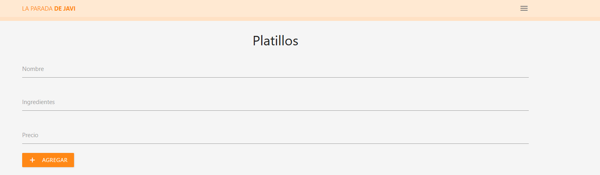
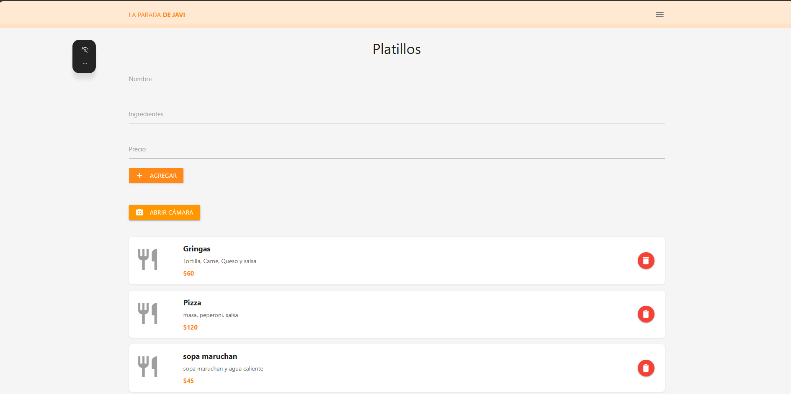
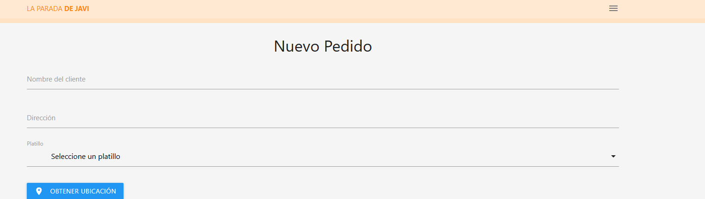
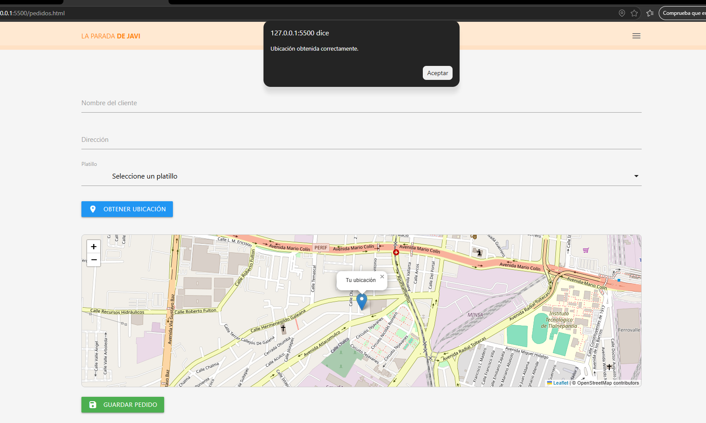
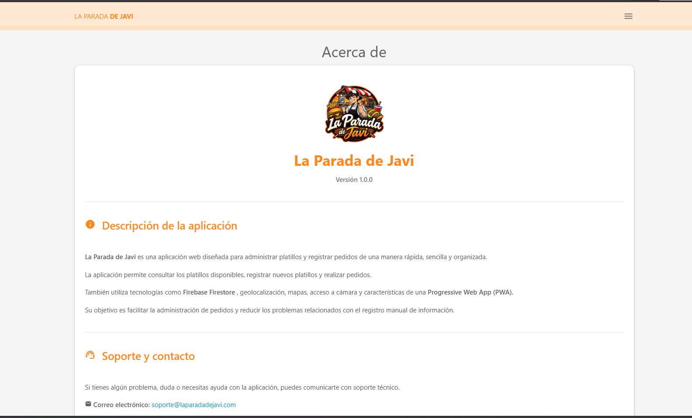
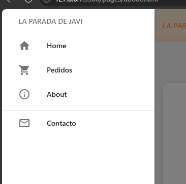

# 🍔 La Parada de Javi

**La Parada de Javi** es una aplicación web para administrar platillos y registrar pedidos de una manera rápida, sencilla y organizada.

El proyecto funciona como una **Progressive Web App (PWA)** e integra herramientas como Firebase Firestore, cámara, geolocalización y mapas.

---

## 📌 Funciones principales

La aplicación permite:

- Agregar platillos.
- Registrar nombre del platillo.
- Registrar ingredientes.
- Registrar precio.
- Tomar fotografías de los platillos utilizando la cámara.
- Mostrar la fotografía de cada platillo.
- Guardar los platillos en Firebase Firestore.
- Eliminar platillos.
- Registrar pedidos.
- Seleccionar un platillo disponible.
- Obtener la ubicación del cliente.
- Obtener automáticamente una dirección mediante geolocalización.
- Mostrar la ubicación en un mapa.
- Guardar pedidos en Firebase Firestore.
- Navegar entre las diferentes páginas mediante un menú lateral.
- Instalar la aplicación como PWA.

---


## 📸 Capturas de pantalla

### 🏠 Página principal



### 📷 Registro de platillos y cámara



### 🛒 Registro de pedidos



### 📍 Ubicación y mapa



### ℹ️ Acerca de



### ☰ Menú lateral



## 📱 Progressive Web App

La aplicación cuenta con características de una PWA mediante:

- `manifest.json`
- Service Worker
- Caché de archivos
- Iconos de aplicación
- Diseño adaptable para dispositivos móviles
- Modo `standalone`

---

## 🛠️ Tecnologías utilizadas

- HTML5
- CSS3
- JavaScript
- Materialize CSS
- Firebase
- Firebase Firestore
- Leaflet
- OpenStreetMap
- Nominatim
- Geolocation API
- MediaDevices API
- Service Workers
- Progressive Web App (PWA)

---

## 📂 Estructura del proyecto

```text
La-Parada-de-Javi/
│
├── index.html
├── pedidos.html
├── manifest.json
├── sw.js
│
├── pages/
│   ├── about.html
│   └── contact.html
│
├── css/
│   ├── styles.css
│   └── materialize.min.css
│
├── js/
│   ├── firebase.js
│   ├── db.js
│   ├── index.js
│   ├── pedidos.js
│   ├── menu.js
│   └── materialize.min.js
│
└── images/
    ├── logo.png
    ├── icon-192.png
    ├── icon-512.png
    └── icon-maskable-512.png
```
